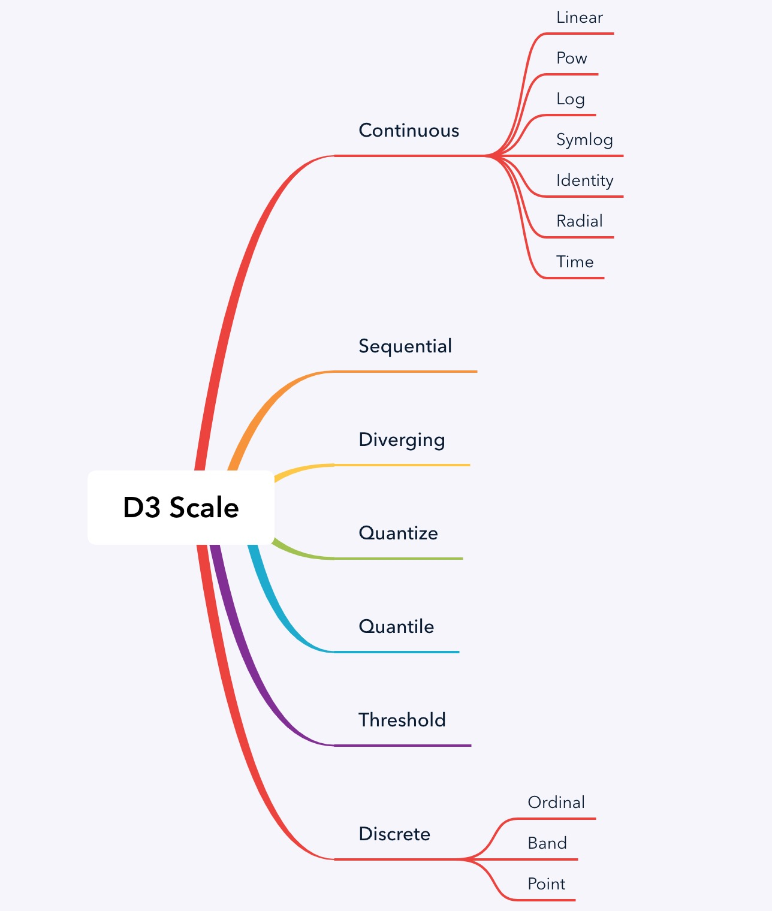

**WIP**

> [d3-scale](https://github.com/d3/d3-scale)是 d3 库下一个独立模块：它是图形中常用的 Scale 的实现，在 d3 的中文文档中，`Scale` 被翻译成 `比例尺`。Scale 负责将数据维度映射到图形通道，如在散点图中，将数据中的数值映射为图形中点的位置像素信息，这就是 Scale 实现的，除了用来映射计算位置这样的数值信息，Scale 也可以用来映射计算其他非数值信息：如颜色值、线条绘制宽度、符号大小尺寸等。不仅是数值类型数据，Scale 可以用在任何类型的数据上，如有命名的分类数据、或其他的离散数据。

d3 中包括的 scale 如下：



## Scale 的定义

从数学角度来看，每一个 scale 可以看出如下函数：

```
有 x ⊂ domain，y ⊂ range，scale f 满足
y = f(x)
```

- domain：原始数据中的数据集合，包括数值、分类数据、离散数据
- range：scale 映射后的集合
- f: scale 函数
- f': invert 函数，大部分 scale 实现了 invert，即可由 range 中的值计算原数据 x = f'(y)
